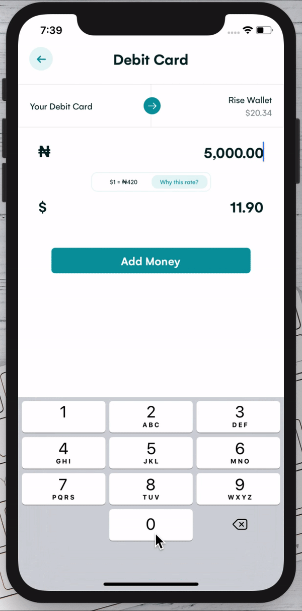

# rise

## Preview

<span>


</span>

<hr />

## Get the app here [APK file](https://github.com/rajibola/rise/releases/tag/0.1.0)

## Getting Started

- Fork or Clone the repo, then set it up:

```
$ cd rise
$ yarn install
```

### Run on Android

```
$ yarn run android
```

### Run on iOS

```
$ cd ios && pod install
$ cd .. && yarn run ios
```
